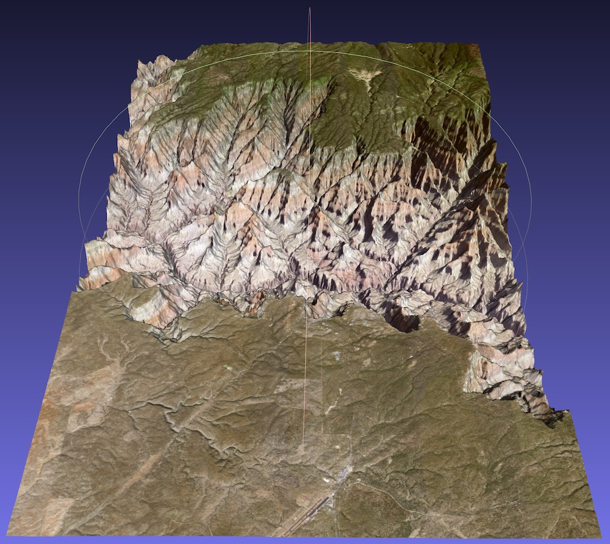
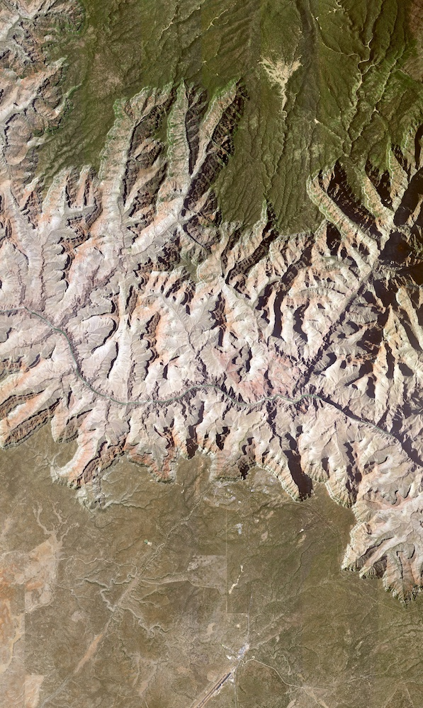

# Topography Tools

A set of simple Python scripts to download and combine digital elevation data and satellite imagery to generate 3D topographical models.

The package consists of three scripts:

- `fetch_topography.py` : download digital elevation data for a given latitude and longitude bounding box
- `fetch_tiles.py` : download (and combine) satellite images from the [U.S. Geological Survey](https://www.usgs.gov/) as a 3D model texture
- `geotiff_to_3d.py` : combine digital elevation and texture data to create a 3D model.

__Note: all longitudinal coordinates use the international standard of negative values indicating west, and positive values indicating east.__

For example, to create a 3D model of the Grand Canyon between `latitude 35.9443, longitude -112.2772` and `latitude 36.2990, longitude -112.0149` using the `Shuttle Radar Topography Mission GL3` dataset (`SRTMG3`, 90m resolution) and a satellite imagery zoom setting (Web Mercator) of `13` we would use the following three script invocations:

```
$ python3 fetch_topography.py -dem SRTMGL3 -fmt GTiff -file topography -lat 35.9443 36.2990 -lon -112.2772 -112.0149
$ python3 fetch_tiles.py -zoom 13 -combine -lat 35.9443 36.2990 -lon -112.2772 -112.0149
$ python3 geotiff_to_3d.py topography.tiff -output out -texture combined.cropped.png -z_scale=0.000025
```

These operations produce the following model as shown in [MeshLab](https://www.meshlab.net/):




## `fetch_topography.py`

Downloads digital elevation data from the [OpenTopography](https://opentopography.org/) servers, and saves the results as a [GeoTIFF](https://earthdata.nasa.gov/esdis/eso/standards-and-references/geotiff) (or optionally in [AAIGrid](https://en.wikipedia.org/wiki/Esri_grid) format).

### Prerequisites:

- Python 3
- [`requests`](https://pypi.org/project/requests/2.7.0/) module (via e.g., `pip3 install requests`)


### Usage

```
$ python3 fetch_topography.py
usage: fetch_topography.py [-h] -lat LAT LAT -lon LON LON [-dem {SRTMGL1,SRTMGL1_E,SRTMGL3,AW3D30,AW3D30_E}] [-fmt {AAIGrid,GTiff}] [-file FILE]

optional arguments:
  -h, --help            show this help message and exit

Region of interest:
  -lat LAT LAT          Min and max latitude in degrees (south pole at -90, north poles at +90)
  -lon LON LON          Min and max longitude in degrees (-180 to +180, positive is east

Data sources, formats, etc:
  -dem {SRTMGL1,SRTMGL1_E,SRTMGL3,AW3D30,AW3D30_E}
                        Source DEM data; SRTMGL1 = Shuttle Radar Topography Mission GL1 (Global 30m), SRTMGL1_E = Shuttle Radar Topography Mission GL1 ellipsoidal (Global 30m), SRTMGL3 = Shuttle Radar Topography Mission GL3 (Global 90m), AW3D30 = ALOS World 3D 30m,
                        AW3D30_E = ALOS World 3D ellipsoidal (30m)
  -fmt {AAIGrid,GTiff}  Output file format; AAIGrid = Arc ASCII Grid, GTiff = GeoTiff
  -file FILE            Output file path prefix
```

### Example

To download the region of the Grand Canyon corresponding to the model shown on this page:

```
$ python3 fetch_topography.py -dem SRTMGL3 -fmt GTiff -file topography -lat 35.9443 36.2990 -lon -112.2772 -112.0149

Run at: Sun Sep 27 17:50:22 2020
Run as: fetch_topography.py -dem SRTMGL3 -fmt GTiff -file topography -lat 35.9443 36.2990 -lon -112.2772 -112.0149

Fetching GeoTiff from Shuttle Radar Topography Mission GL3 (Global 90m) ...
https://portal.opentopography.org/API/globaldem?demtype=SRTMGL3&west=-112.2772&east=-112.0149&south=35.9443&north=36.299&outputFormat=GTiff => topography.tiff

Read 33 chunks, 0.26 MiB
Done.
```

This produces the [GeoTIFF](https://earthdata.nasa.gov/esdis/eso/standards-and-references/geotiff) output file `topography.tiff` and two text files contianing the script's standard output and standard error streams (`stdout.txt` and `stderr.txt`, respectively).

## `fetch_tiles.py`

Downloads (and caches) satellite map tile imagery from the [U.S. Geological Survey](https://www.usgs.gov). The local tile image cache directory is checked for previously downloaded data before each tile is downloaded.

### Prerequisites

- Python 3
- [`requests`](https://pypi.org/project/requests/2.7.0/) module (via e.g., `pip3 install requests`)
- [`Pillow`](https://pypi.org/project/Pillow/)

### Usage

```
$ python3 fetch_tiles.py
usage: fetch_tiles.py [-h] -lat LAT LAT -lon LON LON -zoom ZOOM [-cache CACHE] [-combine]

optional arguments:
  -h, --help    show this help message and exit

Region of interest:
  -lat LAT LAT  Min and max latitude in degrees (south pole at -90, north poles at +90)
  -lon LON LON  Min and max longitude in degrees (-180 to +180, positive is east
  -zoom ZOOM    Zoom level (0 to 23, larger values include more detail)

Data caching:
  -cache CACHE  Directory name for cached tile data

Tile combination:
  -combine      If specified, combine tiled data into single image
```

### Example

To generate a texture image for the Grand Canyon model shown on this page at zoom level 13:

```
$ python3 fetch_tiles.py -zoom 13 -combine -lat 35.9443 36.2990 -lon -112.2772 -112.0149

Run at: Sun Sep 27 17:39:51 2020
Run as: fetch_tiles.py -zoom 13 -combine -lat 35.9443 36.2990 -lon -112.2772 -112.0149

Inputs:

  Latitude (degrees)   : 35.9443 to 36.299
  Longitude (degrees)  : -112.2772 to -112.0149
  Zoom level           : 13
  Tile cache directory : "cache"

Outputs

  Pixel (y0,y1) => (tile:subpixel,tile:subpixel) : (821364.57,823922.59) => (3208:116,3218:114)
  Pixel (x0,x1) => (tile:subpixel,tile:subpixel) : (394513.90,396041.91) => (1541:17,1547:9)

Requires 7 x 11 tile set (77 tiles total)
Uncropped image is 1792 x 1792 pixels
Cropped image is 1529 x 2559 pixels (22.46% reduction)

  tile_13_1541_3209 : 8/77 (10%)
  tile_13_1542_3210 : 16/77 (21%)
  tile_13_1543_3211 : 24/77 (31%)
  tile_13_1543_3212 : 31/77 (40%)
  tile_13_1544_3213 : 39/77 (51%)
  tile_13_1545_3214 : 47/77 (61%)
  tile_13_1545_3215 : 54/77 (70%)
  tile_13_1546_3216 : 62/77 (81%)
  tile_13_1547_3217 : 70/77 (91%)

Saving combined.raw.png ...
Cropping ...
Saving combined.cropped.png ...
Done.
```

This produces the two image files `combined.raw.png` and `combined.cropped.png`, with the former containing all tiles encompassing the specified region, and the latter containing only the pixels that lie in the region itself. Also produced are the files `stdout.txt` and `stderr.txt`, containing a copy of the script's standard output and standard error streams respectively.

If the tile cache directory `cache` did not exist in the current directory, it was created - and now contains the individual satellite image tiles that were combined into the final images. The tile file names follow the format `tile_[zoom_level]_[y]_[x]` with `y` and `x` denoting the Web Mercator tile coordinates for accessing the U.S. Geological Survey's [tile server](https://basemap.nationalmap.gov/arcgis/rest/services/USGSImageryOnly/MapServer/).

The resultant `combined.cropped.png` file should look something like this, albeit at far higher resolution:



__Note:__ for high zoom levels, patches of the satellite data may be missing. If this is the case, reduce the zoom level and try again. Note that higher zoom levels are typically available only inside the boundaries of the U.S.A; other parts of the world may only have satellite data for lower zoom levels.

## `geotiff_to_3d.py`

Combine digital elevation data (in the form of a [GeoTIFF](https://earthdata.nasa.gov/esdis/eso/standards-and-references/geotiff) file) with an optional texture to create a 3D object in the common [Wavefront .obj](https://en.wikipedia.org/wiki/Wavefront_.obj_file) format.

### Prerequisites

- Python 3
- [`rasterio`](https://pypi.org/project/rasterio/0.13.2/) module (via e.g., `pip3 install rasterio`)

### Usage

```
$ python3 geotiff_to_3d.py
usage: geotiff_to_3d.py [-h] [-output OUTPUT] [-z_scale Z_SCALE] [-texture TEXTURE] [-filter FILTER FILTER FILTER FILTER FILTER FILTER FILTER FILTER] [-resample RESAMPLE] [-method {nearest,bilinear,cubic}] gtiff

optional arguments:
  -h, --help            show this help message and exit

Input options:
  gtiff                 GeotTiff input file path

Output options:
  -output OUTPUT        Output file prefix
  -z_scale Z_SCALE      Scaling applied to z axis (inferred from other dims if omitted)
  -texture TEXTURE      Texture file (triggers use of texture coords etc in output file)
  -filter FILTER FILTER FILTER FILTER FILTER FILTER FILTER FILTER
                        Four lat & lon pairs (ordered CLOCKWisE) defining a quadrilateral filtering area
  -resample RESAMPLE    Resample data scaling factor (see also "method")
  -method {nearest,bilinear,cubic}
                        Resampling method
```

### Example

To combine the digital elevation data with the satellite texture data processed in the examples for `fetch_topography.py` and `fetch_tiles.py` above:

```
$ python3 geotiff_to_3d.py topography.tiff -output out -texture combined.cropped.png -z_scale=0.000025

Run at: Sun Sep 27 17:40:51 2020
Run as: geotiff_to_3d.py topography.tiff -output out -texture combined.cropped.png -z_scale=0.000025

Bounds: -112.27736111110215,36.29902777777464 -> -112.01513888887989,35.94430555555237
Dims: 944 x 1277 ; Resolution: 0.0002777777777778146 x 0.0002777777777778146
Z range is apparently 667 to 2741
File contains 1 band(s), using first ...

Writing material file...
Writing .obj file...
  vertex positions...
  vertex texture coords...
  faces...
Done.
```

Here, we apply a scaling of `0.000025` to the elevations in order to avoid the `z` dimension dominating the model; as vertex coordinates along the ground plane are written as latitude and longitude values (in degrees), care is required to prevent the `z` axis data (elevation, in metres) being wildly larger than the other axes.
