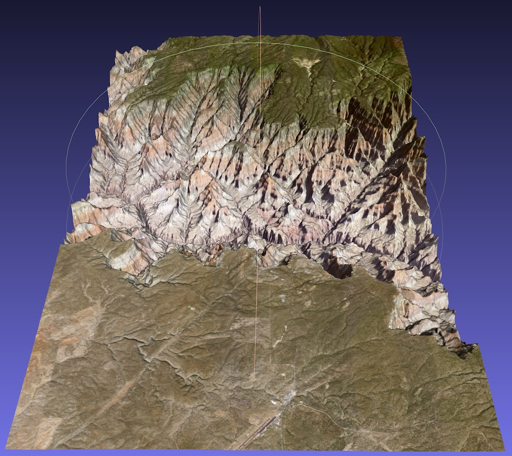
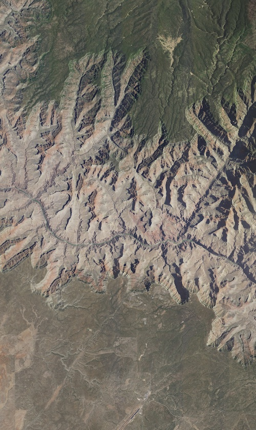

# Topography Tools

A set of simple Python scripts to download and combine digital elevation data and satellite imagery to generate 3D topographical models.

The package consists of three scripts:

- `fetch_topography.py` : download digital elevation data for a given latitude and longitude bounding box
- `fetch_tiles.py` : download (and combine) satellite image tiles as a 3D model texture
- `geotiff_to_3d.py` : combine digital elevation and texture data to create a 3D model.
- `estimate_spans.py` : estimate interval (in degrees) corresponding to 1m for specified latitude, or dimensions (in metres) of zone enclosed by lat/lon bounding box

__Note: all longitudinal coordinates use the international standard of negative values indicating west, and positive values indicating east.__

For example, to create a 3D model of the Grand Canyon between `latitude 35.9443, longitude -112.2772` and `latitude 36.2990, longitude -112.0149` using the `Shuttle Radar Topography Mission GL3` dataset (`SRTMG3`, 90m resolution) and a satellite imagery from the [U.S. Geological Survey](https://www.usgs.gov/) at zoom setting (Web Mercator) of `13` we would use the following three script invocations:

```
$ python3 fetch_topography.py -src SRTMGL3 -out_fmt GTiff -file topography -lat 35.9443 36.2990 -lon -112.2772 -112.0149
$ python3 fetch_tiles.py -src usgs -zoom 13 -combine -lat 35.9443 36.2990 -lon -112.2772 -112.0149
$ python3 -lat 35.9443 36.2990 -lon -112.2772 -112.0149 -n_samples_x 500 -n_samples_y 500 -output out -texture combined.cropped.jpeg
```

These operations produce the following model as shown in [MeshLab](https://www.meshlab.net/):




## `fetch_topography.py`

Downloads digital elevation data from the [OpenTopography](https://opentopography.org/) servers, and saves the results as a [GeoTIFF](https://earthdata.nasa.gov/esdis/eso/standards-and-references/geotiff) (or optionally in [AAIGrid](https://en.wikipedia.org/wiki/Esri_grid) format).

### Prerequisites:

- Python 3
- [`requests`](https://pypi.org/project/requests/2.7.0/) module (via e.g., `pip3 install requests`)


### Usage

```
$ python3 fetch_topography.py
usage: fetch_topography.py [-h]
                           [-src {SRTMGL1,SRTMGL1_E,SRTMGL3,AW3D30,AW3D30_E}]
                           -lat LAT LAT -lon LON LON
                           [-out_fmt {AAIGrid,GTiff}] [-file FILE]

optional arguments:
  -h, --help            show this help message and exit

Region of interest:
  -src {SRTMGL1,SRTMGL1_E,SRTMGL3,AW3D30,AW3D30_E}
                        Source DEM data; SRTMGL1 = Shuttle Radar Topography
                        Mission GL1 (Global 30m), SRTMGL1_E = Shuttle Radar
                        Topography Mission GL1 ellipsoidal (Global 30m),
                        SRTMGL3 = Shuttle Radar Topography Mission GL3 (Global
                        90m), AW3D30 = ALOS World 3D 30m, AW3D30_E = ALOS
                        World 3D ellipsoidal (30m)
  -lat LAT LAT          Min and max latitude in degrees (south pole at -90,
                        north poles at +90)
  -lon LON LON          Min and max longitude in degrees (-180 to +180,
                        positive is east

Data sources, formats, etc:
  -out_fmt {AAIGrid,GTiff}
                        Output file format; AAIGrid = Arc ASCII Grid, GTiff =
                        GeoTiff
  -file FILE            Output file path prefix
```

### Example

To download the region of the Grand Canyon corresponding to the model shown on this page:

```
$ python3 fetch_topography.py -src SRTMGL3 -out_fmt GTiff -file topography -lat 35.9443 36.2990 -lon -112.2772 -112.0149

Run at: Mon Dec 21 12:27:39 2020
Run as: fetch_topography.py -src SRTMGL3 -out_fmt GTiff -file topography -lat 35.9443 36.2990 -lon -112.2772 -112.0149

Fetching GeoTiff from Shuttle Radar Topography Mission GL3 (Global 90m) ...
https://portal.opentopography.org/API/globaldem?demtype=SRTMGL3&west=-112.2772&east=-112.0149&south=35.9443&north=36.299&outputFormat=GTiff => topography.tiff

Read 33 chunks, 0.26 MiB
Done.
```

This produces the [GeoTIFF](https://earthdata.nasa.gov/esdis/eso/standards-and-references/geotiff) output file `topography.tiff` and two text files contianing the script's standard output and standard error streams (`stdout.txt` and `stderr.txt`, respectively).

## `fetch_tiles.py`

Downloads (and caches) satellite map tile imagery from specified sources. The local tile image cache directory is checked for previously downloaded data before each tile is downloaded.

__Note:__ Higher zoom levels indicate greater levels of detail. However, at high zoom levels (e.g., >12) patches of the satellite data may be missing. If this is the case, reduce the zoom level and try again. Note that higher zoom levels are typically available only inside the boundaries of the U.S.A; other parts of the world may only have satellite data for lower zoom levels. Google typically has higher zoom levels available vs the USGS.

### Prerequisites

- Python 3
- [`requests`](https://pypi.org/project/requests/2.7.0/) module (via e.g., `pip3 install requests`)
- [`Pillow`](https://pypi.org/project/Pillow/) module (via e.g., `pip3 install pillow`)

### Usage

```
$ python3 fetch_tiles.py
usage: fetch_tiles.py [-h] -src {usgs,google} -lat LAT LAT -lon LON LON -zoom
                      ZOOM [-cache CACHE] [-combine] [-out_fmt OUT_FMT]

optional arguments:
  -h, --help          show this help message and exit

Region of interest:
  -src {usgs,google}  Source of satellite tile data
  -lat LAT LAT        Min and max latitude in degrees (south pole at -90,
                      north poles at +90)
  -lon LON LON        Min and max longitude in degrees (-180 to +180, positive
                      is east
  -zoom ZOOM          Zoom level (0 to 23, larger values include more detail)

Data caching:
  -cache CACHE        Directory name for cached tile data

Tile combination:
  -combine            If specified, combine tiled data into single image
  -out_fmt OUT_FMT    Format for combined output image (e.g., "jpeg" or "png")
  ```

### Example

To generate a texture image for the Grand Canyon model shown on this page at zoom level 13 from the USGS satellite data:

```
$ python3 fetch_tiles.py -src usgs -zoom 13 -combine -lat 35.9443 36.2990 -lon -112.2772 -112.0149

Run at: Mon Dec 21 18:34:30 2020
Run as: fetch_tiles.py -src usgs -zoom 13 -combine -lat 35.9443 36.2990 -lon -112.2772 -112.0149

Inputs:

  Tile source          : usgs
  Latitude (degrees)   : 35.9443 to 36.299
  Longitude (degrees)  : -112.2772 to -112.0149
  Zoom level           : 13
  Tile cache directory : "cache"

Outputs

  Pixel y range => (tile:offset,tile:offset) : (821364.57,823922.59) => (3208:116,3218:114)
  Pixel x range => (tile:offset,tile:offset) : (394513.90,396041.91) => (1541:17,1547:9)

Requires 7 x 11 tile set (77 tiles total)
Uncropped image is 1792 x 2816 pixels
Cropped image is 1529 x 2559 pixels (22.46% reduction)

Downloading...
  cache/usgs_13_1541_3209.png : 8/77 (10%)
  cache/usgs_13_1542_3210.png : 16/77 (21%)
  cache/usgs_13_1543_3211.png : 24/77 (31%)
  cache/usgs_13_1543_3212.png : 31/77 (40%)
  cache/usgs_13_1544_3213.png : 39/77 (51%)
  cache/usgs_13_1545_3214.png : 47/77 (61%)
  cache/usgs_13_1545_3215.png : 54/77 (70%)
  cache/usgs_13_1546_3216.png : 62/77 (81%)
  cache/usgs_13_1547_3217.png : 70/77 (91%)

Saving combined.raw.jpeg ...
Cropping ...
Saving combined.cropped.jpeg ...
Done.
```

This produces the two image files `combined.raw.jpeg` and `combined.cropped.jpeg`, with the former containing all tiles encompassing the specified region, and the latter containing only the pixels that lie in the region itself. Also produced are the files `stdout.txt` and `stderr.txt`, containing a copy of the script's standard output and standard error streams respectively.

If the tile cache directory `cache` did not exist in the current directory, it was created - and now contains the individual satellite image tiles that were combined into the final images. The tile file names follow the format `tile_[zoom_level]_[y]_[x]` with `y` and `x` denoting the Web Mercator tile coordinates for accessing the tile server.

The resultant `combined.cropped.jpeg` file should look something like this, albeit at far higher resolution:



## `geotiff_to_3d.py`

Combine digital elevation data (in the form of a [GeoTIFF](https://earthdata.nasa.gov/esdis/eso/standards-and-references/geotiff) file) with an optional texture to create a 3D object in the common [Wavefront .obj](https://en.wikipedia.org/wiki/Wavefront_.obj_file) format.

### Prerequisites

- Python 3
- [`rasterio`](https://pypi.org/project/rasterio/0.13.2/) module (via e.g., `pip3 install rasterio`)
- [`scipy`](https://www.scipy.org/) module (via e.g., `pip3 install scipy`)

The GeoTIFF processing technically requires [`numpy`](https://numpy.org/), but this should be installed automatically by the 'rasterio' module.

### Usage

```
$ python3 geotiff_to_3d.py
usage: geotiff_to_3d.py [-h] -lat LAT LAT -lon LON LON -n_samples_x N_SAMPLES_X -n_samples_y N_SAMPLES_Y [-texture TEXTURE] [-output OUTPUT]
                        [-z_scale Z_SCALE] [-x0 X0] [-y0 Y0] [-z0 Z0] [-reorder REORDER]
                        gtiff

optional arguments:
  -h, --help            show this help message and exit

Input options:
  gtiff                 GeotTIFF input file path

Output options:
  -lat LAT LAT          Min and max latitude in degrees (south pole at -90, north poles at +90)
  -lon LON LON          Min and max longitude in degrees (-180 to +180, positive is east
  -n_samples_x N_SAMPLES_X
                        Number of samples on x (longitudinal) axis
  -n_samples_y N_SAMPLES_Y
                        Number of samples on y (latitudinal axis
  -texture TEXTURE      Texture file (triggers use of texture coords etc in output file)
  -output OUTPUT        Output file prefix
  -z_scale Z_SCALE      Scaling applied to z axis (inferred from other dims if omitted)
  -x0 X0                Make x coords relative to this value
  -y0 Y0                Make y coords relative to this value
  -z0 Z0                Make z coords relative to this value
  -reorder REORDER      Reorder string for axes in output```
```

### Example

To combine the digital elevation data with the satellite texture data processed in the examples for `fetch_topography.py` and `fetch_tiles.py` above:

```
$ python3 geotiff_to_3d.py topography.tiff -output out -texture combined.cropped.png -z_scale=0.000025

File contains 1 band(s), using first ...

Run at: Sun Apr 18 14:30:22 2021
Run as: geotiff_to_3d.2.py topography.tiff -lat 35.9443 36.2990 -lon -112.2772 -112.0149 -n_samples_x 500 -n_samples_y 500 -output out -texture combined.cropped.jpeg

GeoTIFF: topography.tiff
  Bounds: -112.27791666668206,35.9445833333388 -> -112.01541666668211,36.29958333333872
  Dims: 315 x 426 ; Resolution: 0.0008333333333331619 x 0.0008333333333331426
  Z range is apparently 686 to 2741

500 samples on global domain x (longitudinal) axis
500 samples on global domain y (latitudinal) axis

Writing material file...
Writing .obj file...
  vertex positions...
  faces...
Done.
```

A scaling can be applied to the elevations in order to avoid the `z` dimension dominating the model; as vertex coordinates along the ground plane are written as latitude and longitude values (in degrees), care is required to prevent the `z` axis data (elevation, in metres) being wildly larger than the other axes.

## `estimate_spans.py`

Etimate the interval (in degrees) corresponding to 1m for a specified latitude, or the span in metres of the region bounded by minimum and maximum latitide and longitude.

The latitudinal span is independent of longitude, but the longitudinal spans depend on the latitude. For latitude 0 degrees (i.e., the equator), the radius of the circle along which longitudinal values lie is equal to the notional radius of the globe. However, as we increase or decrease the latitude, the radius of this circle shrinks as the notional sphere representing the earth tapers towards the poles.

### Prerequisites:

- Python 3

### Usage

```
$ python3 estimate_spans.py

Usage:

[1]  python3 estimate_spans.py lat_degs
[2]  python3 estimate_spans.py to_deg lat_degs lon_degs lat_span_m lon_span_m
[3]  python3 estimate_spans.py to_m lat0 lat1 lon0 lon1

Where:

[1] : report estimated lat/lon intervals (degs) corresponding to 1m at specified latitude (degs)
[2] : report estimated span (m) corresponding to specified bounding box (degs)
[3] : report estimated lat/lon intervals (degs) corresponding to span_m around specified latitude (degs)
```

### Examples

To determine the interval (in degrees) corresponding to 1m at a latitude of e.g. 34.6 degrees:

```
$ python3 estimate_spans.py 34.6
degs lat,lon for 1m @ lat=34.6: 8.993216059187306e-06, 1.0925548187354827e-05
```


To determine the spans for the region described by latitude 0 to 1 degrees, and longitude 0 to 1 degrees:

```
$ python3 estimate_spans.py to_m 0 1 0 1
lat span: 111194.92664455873, lon span at lat0: 111194.92664455873, lon span at lat1: 111177.99111864607
```

As can be seen in the output above, the longitudinal spans differ slightly between `lat0` (0 degrees) and `lat1` (1 degree).

To determine the latitude and longitude that bound a region of 1500 x 500 m around the point lat = 35 lon = -107:

```
$ python3 estimate_spans.py to_deg 35 -107 1500 500
-lat 34.99325508795561 35.00674491204439 -lon -107.00274467240908 -106.99725532759092
```